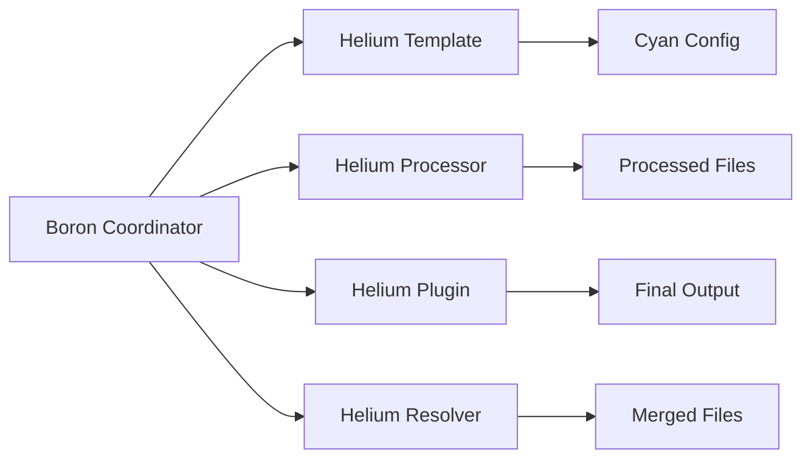
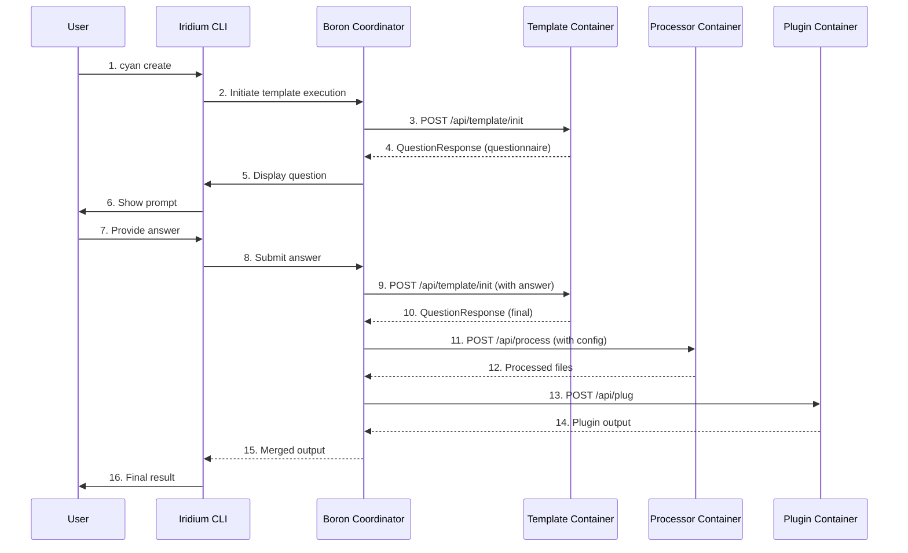

# Architecture

## Overview

Helium provides identical functionality across three programming languages (Node.js, Python, .NET), enabling template authors to work with their preferred language while maintaining API compatibility through a shared HTTP protocol. Each SDK implements four core APIs: Template (interactive prompting), Processor (file transformation), Plugin (post-processing), and Resolver (conflict resolution).

## System Context

### High-Level View

| Component         | Role                                                   |
| ----------------- | ------------------------------------------------------ |
| Boron Coordinator | Orchestrates SDK containers, manages user interactions |
| Helium Template   | Interactive prompting for Cyan config generation       |
| Helium Processor  | File transformation based on template output           |
| Helium Plugin     | Post-processing and file modifications                 |
| Helium Resolver   | Conflict resolution for multi-layer files              |
| Cyan Config       | Structured output defining processors and plugins      |
| Processed Files   | Transformed files from processor execution             |
| Final Output      | Complete output after all plugins execute              |
| Merged Files      | Files merged from multiple template layers             |

### Component Interaction

| #   | Step                        | What                                                             | Key File                                                  |
| --- | --------------------------- | ---------------------------------------------------------------- | --------------------------------------------------------- |
| 1   | cyan create                 | User initiates template execution via Iridium CLI                | CLI                                                       |
| 2   | Initiate template execution | Iridium CLI communicates with Boron coordinator                  | Coordinator                                               |
| 3   | POST /api/template/init     | Boron sends answers to template                                  | `sdks/node/src/main.ts` → `StartTemplate()`               |
| 4   | QuestionResponse            | Template returns next question or final config                   | `sdks/node/src/domain/template/service.ts` → `template()` |
| 5   | Display question            | Boron forwards question to Iridium CLI                           | Coordinator                                               |
| 6   | Show prompt                 | Iridium CLI displays question to user                            | CLI                                                       |
| 7   | Provide answer              | User answers the question                                        | CLI                                                       |
| 8   | Submit answer               | Iridium CLI sends answer to Boron                                | Coordinator                                               |
| 9   | POST /api/template/init     | Boron resends with new answer                                    | `sdks/node/src/main.ts` → `StartTemplate()`               |
| 10  | QuestionResponse            | Template returns completed Cyan config                           | `sdks/node/src/domain/template/service.ts` → `template()` |
| 11  | POST /api/process           | Boron sends config to processor                                  | `sdks/node/src/main.ts` → `StartProcessor()`              |
| 12  | Processed files             | Processor returns transformed files                              | `sdks/node/src/domain/processor/service.ts` → `process()` |
| 13  | POST /api/plug              | Boron sends files to plugin                                      | `sdks/node/src/main.ts` → `StartPlugin()`                 |
| 14  | Plugin output               | Plugin returns processed output                                  | `sdks/node/src/domain/plugin/service.ts` → `plug()`       |
| 15  | Merged output               | Boron coordinator merges all outputs from processors and plugins | Coordinator                                               |
| 16  | Final result                | Iridium CLI presents the merged result to user                   | CLI                                                       |

## Key Components

| Component         | Purpose                                   | Key Files                                                                                                                                                                                   |
| ----------------- | ----------------------------------------- | ------------------------------------------------------------------------------------------------------------------------------------------------------------------------------------------- |
| Template Service  | Manages checkpoint-based questioning flow | `sdks/node/src/domain/template/service.ts` `sdks/python/cyanprintsdk/domain/template/service.py` `sdks/dotnet/sulfone-helium/Domain/Template/Service.cs`                              |
| Processor Service | Manages file transformation               | `sdks/node/src/domain/processor/service.ts` `sdks/python/cyanprintsdk/domain/processor/service.py` `sdks/dotnet/sulfone-helium/Domain/Processor/Service.cs`                           |
| Plugin Service    | Manages post-processing hooks             | `sdks/node/src/domain/plugin/service.ts` `sdks/python/cyanprintsdk/domain/plugin/service.py` `sdks/dotnet/sulfone-helium/Domain/Plugin/Service.cs`                                    |
| Resolver Service  | Manages conflict resolution for files     | `sdks/node/src/domain/resolver/service.ts` `sdks/python/cyanprintsdk/domain/resolver/service.py` `sdks/dotnet/sulfone-helium/Domain/Resolver/Service.cs`                              |
| StatelessInquirer | Caches answers for checkpoint flow        | `sdks/node/src/domain/service/stateless_inquirer.ts` `sdks/python/cyanprintsdk/domain/service/stateless_inquirer.py` `sdks/dotnet/sulfone-helium/Domain/Service/StatelessInquirer.cs` |
| CyanFileHelper    | Virtual file system abstraction           | `sdks/node/src/domain/core/fs/cyan_fs_helper.ts` `sdks/python/cyanprintsdk/domain/core/fs/cyan_fs_helper.py` `sdks/dotnet/sulfone-helium/Domain/Core/FileSystem/CyanFileHelper.cs`    |

## Key Decisions

### 1. Checkpoint-based Exception Flow

**Context**: Templates need to ask questions interactively while running in containerized environments without blocking or server-side state.

**Decision**: Templates throw `OutOfAnswerException` when answers are missing. The coordinator catches this exception, prompts the user, and retries with the new answer.

**Rationale**:

- Clean control flow without nested callbacks
- No blocking - container throws and exits immediately
- Enables back navigation (not possible in linear scripts)
- Multi-client support (CLI, WebApp, future chatbots)

**Trade-off**: More complex error handling - must distinguish between checkpoint exceptions and actual errors.

**Key Files**:

- Node: `sdks/node/src/domain/service/out_of_answer_error.ts`
- Python: `sdks/python/cyanprintsdk/domain/service/out_of_answer_error.py`
- .NET: `sdks/dotnet/sulfone-helium/Domain/Service/OutOfAnswerException.cs`

### 2. Stateless Inquirer

**Context**: Server-side scaling and container lifecycle management need to be simple.

**Decision**: Coordinator sends all answers each request; template stores no state between requests.

**Rationale**:

- Server-side scaling - no session storage required
- Simplified container lifecycle - containers can be restarted
- Client-state model - easier to implement back navigation

**Trade-off**: Larger request payloads (all answers sent each time).

**Key Files**:

- Node: `sdks/node/src/domain/service/stateless_inquirer.ts`
- Python: `sdks/python/cyanprintsdk/domain/service/stateless_inquirer.py`
- .NET: `sdks/dotnet/sulfone-helium/Domain/Service/StatelessInquirer.cs`

### 3. Multi-Language SDKs

**Context**: Developers have different language preferences and ecosystem requirements.

**Decision**: Identical SDK APIs provided in Node.js, Python, and .NET with shared HTTP protocol.

**Rationale**:

- Meet developer preferences
- Leverage language-specific ecosystems
- Maintain API consistency through OAS3 protocol

**Trade-off**: Maintenance overhead - three implementations to keep in sync.

### 4. Virtual File System

**Context**: Containers need file access without shared filesystem dependencies across different languages.

**Decision**: Files passed as data structures (`VirtualFile`) instead of direct disk access through `CyanFileHelper`.

**Rationale**:

- Container isolation - no shared filesystem dependency
- Language independence - same file representation across SDKs
- Testability - easy to mock file operations

**Trade-off**: Memory overhead for large file sets.

**Key Files**:

- Node: `sdks/node/src/domain/core/fs/cyan_fs_helper.ts`, `sdks/node/src/domain/core/fs/virtual_file.ts`
- Python: `sdks/python/cyanprintsdk/domain/core/fs/cyan_fs_helper.py`, `sdks/python/cyanprintsdk/domain/core/fs/virtual_file.py`
- .NET: `sdks/dotnet/sulfone-helium/Domain/Core/FileSystem/CyanFileHelper.cs`, `sdks/dotnet/sulfone-helium/Domain/Core/FileSystem/VirtualFileStream.cs`

## Related

- [Server-Client Prompting Concept](./concepts/01-server-client-prompting.md) - How Boron orchestrates SDK containers
- [Template API Feature](./features/01-template-api.md) - Interactive prompting implementation
- [Cyan Config Concept](./concepts/02-cyan-config.md) - The output structure from templates
