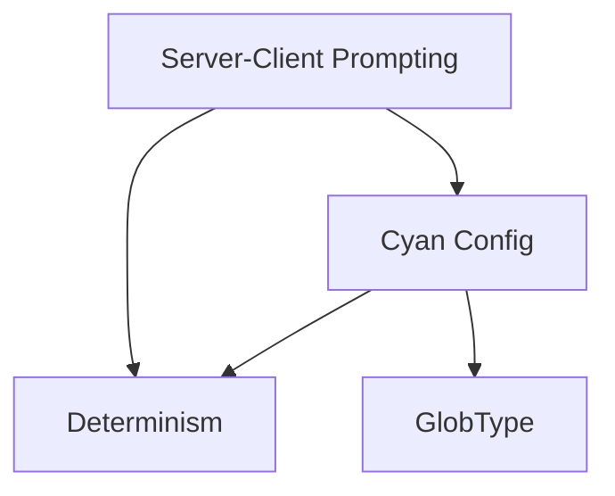

# Concepts Overview

Brief description of what this section contains.

## Map

How items in this section relate:

| Item | Role |
|------|------|
| Server-Client Prompting | Orchestration pattern between Boron and SDK containers |
| Cyan Config | Output structure from templates defining processors/plugins |
| Determinism | Caching mechanism for non-deterministic values |
| GlobType | File handling strategy (template vs copy) |

## All Concepts

| Item | What | Why | Key Files |
|------|------|-----|-----------|
| [Server-Client Prompting](./01-server-client-prompting.md) | Checkpoint-based exception flow for interactive questioning | Enables stateless containerized prompting | `sdks/node/src/domain/service/stateless_inquirer.ts` |
| [Cyan Config](./02-cyan-config.md) | Structured output defining processors and plugins | Standardizes template output for processor/plugin execution | `sdks/node/src/domain/core/cyan.ts` |
| [Determinism](./03-determinism.md) | Cached non-deterministic values for reproducible builds | Enables reproducible builds with same answers | `sdks/node/src/domain/service/stateless_determinism.ts` |
| [GlobType](./04-globtype.md) | File handling mode (Template vs Copy) | Controls whether files are processed or copied as-is | `sdks/node/src/domain/core/cyan.ts` |

## Groups

### Group 1: Orchestration

- **[Server-Client Prompting](./01-server-client-prompting.md)** - How Boron orchestrates SDK containers

### Group 2: Output Structure

- **[Cyan Config](./02-cyan-config.md)** - The output structure from templates
- **[GlobType](./04-globtype.md)** - Template vs Copy file handling

### Group 3: Caching

- **[Determinism](./03-determinism.md)** - Why and how deterministic values work
