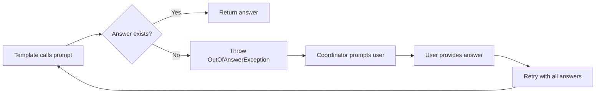
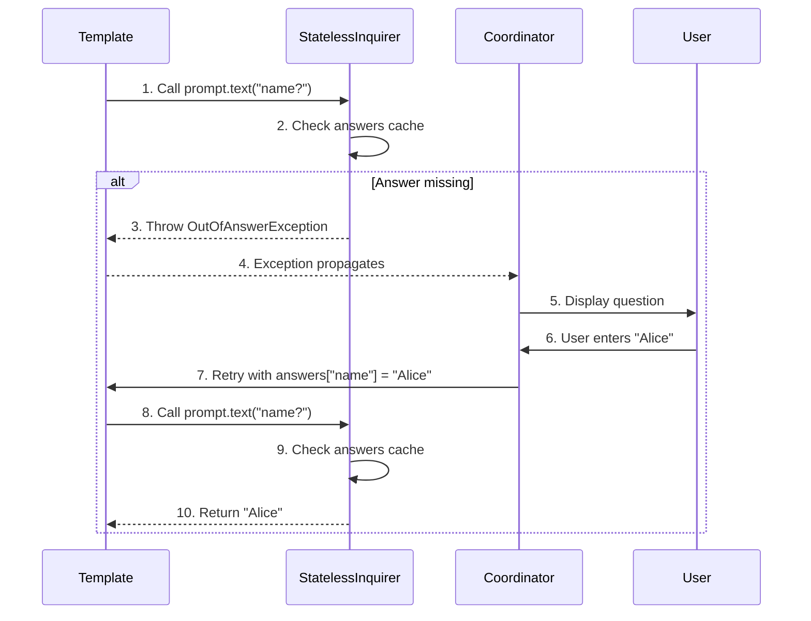

# Server-Client Prompting

**What**: Checkpoint-based exception flow where templates throw `OutOfAnswerException` when answers are missing, enabling the coordinator to prompt users interactively while keeping containers stateless.

**Why**: Enables interactive prompting in containerized environments without blocking or server-side state storage, allowing back navigation and multi-client support.

**Key Files**:

- `sdks/node/src/domain/service/stateless_inquirer.ts` → `StatelessInquirer.__call()`
- `sdks/node/src/domain/service/out_of_answer_error.ts` → `OutOfAnswerException`
- `sdks/python/cyanprintsdk/domain/service/stateless_inquirer.py` → `StatelessInquirer.__call__()`
- `sdks/python/cyanprintsdk/domain/service/out_of_answer_error.py` → `OutOfAnswerError`
- `sdks/dotnet/sulfone-helium/Domain/Service/StatelessInquirer.cs` → all question methods
- `sdks/dotnet/sulfone-helium/Domain/Service/OutOfAnswerException.cs`

## Overview

Server-client prompting is the core pattern that enables Helium templates to ask questions interactively while running in containerized environments. Instead of blocking on user input, templates throw a special exception when they need an answer. The Boron coordinator catches this exception, prompts the user via the appropriate UI (CLI, WebApp, etc.), and retries the template execution with the new answer.

This checkpoint-based flow has several key benefits:

- **Stateless**: No session storage required on the server
- **Non-blocking**: Containers throw and exit immediately when waiting for input
- **Back navigation**: Users can go back and change previous answers
- **Multi-client**: Same template works with CLI, web, and future chatbot interfaces

The pattern works by having the template send all accumulated answers with each request. The `StatelessInquirer` checks if an answer exists for each question before throwing the checkpoint exception.

## Flow

### High-Level

### Detailed

| #   | Step                       | What                               | Why                          | Key File                                                  |
| --- | -------------------------- | ---------------------------------- | ---------------------------- | --------------------------------------------------------- |
| 1   | Call prompt.text()         | Template requests user input       | Begin checkpoint flow        | `sdks/node/src/domain/core/inquirer.ts` → `text()`        |
| 2   | Check answers cache        | Inquirer looks for existing answer | Reuse cached answers         | `sdks/node/src/domain/service/stateless_inquirer.ts`      |
| 3   | Throw OutOfAnswerException | Signal that answer is needed       | Non-blocking checkpoint      | `sdks/node/src/domain/service/out_of_answer_error.ts`     |
| 4   | Exception propagates       | Exception bubbles to coordinator   | Signal coordinator to prompt | `sdks/node/src/domain/template/service.ts` → `template()` |
| 5   | Display question           | Coordinator shows UI to user       | Collect user input           | Coordinator                                               |
| 6   | User enters answer         | User provides input                | Get answer for retry         | UI                                                        |
| 7   | Retry with answers         | Coordinator resends all answers    | Stateless retry              | `sdks/node/src/main.ts` → `POST /api/template/init`       |
| 8   | Call prompt.text()         | Template re-enters at same point   | Resume execution             | `sdks/node/src/domain/core/inquirer.ts` → `text()`        |
| 9   | Check answers cache        | Inquirer finds cached answer       | Answer now exists            | `sdks/node/src/domain/service/stateless_inquirer.ts`      |
| 10  | Return answer              | Inquirer returns cached value      | Continue execution           | `sdks/node/src/domain/service/stateless_inquirer.ts`      |

## Edge Cases

- **Back navigation**: When user goes back, coordinator removes answers from that point forward and retries with earlier state
- **Validation errors**: Validation returns error message but doesn't throw; template continues with same question
- **Determinism**: Deterministic state is preserved across retries for cached random values

## Related

- [Template API Feature](../features/01-template-api.md) - Interactive prompting implementation
- [Determinism Concept](./03-determinism.md) - Cached non-deterministic values
- [Cyan Config Concept](./02-cyan-config.md) - The output structure from templates
