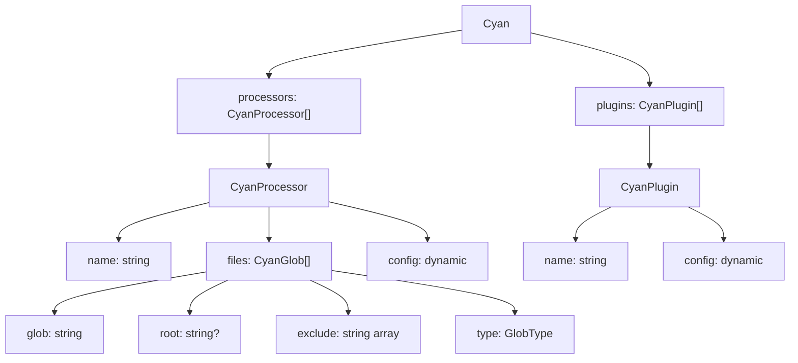

# Cyan Config

**What**: Structured output from templates that defines which processors and plugins to execute, along with their file globs and configuration.

**Why**: Provides a standardized format for passing template output to the Boron coordinator, which then orchestrates processor and plugin execution.

**Key Files**:

- `sdks/node/src/domain/core/cyan.ts` → `Cyan`, `CyanProcessor`, `CyanPlugin`, `CyanGlob`
- `sdks/python/cyanprintsdk/domain/core/cyan.py` → `Cyan`, `CyanProcessor`, `CyanPlugin`, `CyanGlob`
- `sdks/dotnet/sulfone-helium/Domain/Core/Cyan.cs` → `Cyan`, `CyanProcessor`, `CyanPlugin`, `CyanGlob`

## Overview

The Cyan config is the primary output of any template execution. It's a structured object that tells the Boron coordinator:

1. Which processors to run
2. Which files each processor should handle (via glob patterns)
3. What configuration each processor receives
4. Which plugins to run after processors
5. What configuration each plugin receives

This structure enables the coordinator to orchestrate the complete file generation pipeline: template → processors → plugins → final output.

The config uses glob patterns to match files, allowing flexible file selection with include/exclude patterns. Each processor and plugin receives its own dynamic configuration object, enabling template authors to pass any data they need.

## Structure



| Component     | Type   | Description                                          |
| ------------- | ------ | ---------------------------------------------------- |
| Cyan          | object | Root config with processors and plugins              |
| CyanProcessor | object | Processor definition with name, files, config        |
| CyanPlugin    | object | Plugin definition with name and config               |
| CyanGlob      | object | File matching pattern with glob, root, exclude, type |

## Fields

### Cyan

| Field      | Type              | Description                              |
| ---------- | ----------------- | ---------------------------------------- |
| processors | `CyanProcessor[]` | Array of processors to run sequentially  |
| plugins    | `CyanPlugin[]`    | Array of plugins to run after processors |

### CyanProcessor

| Field  | Type         | Description                        |
| ------ | ------------ | ---------------------------------- |
| name   | `string`     | Processor identifier               |
| files  | `CyanGlob[]` | Glob patterns for files to process |
| config | `dynamic`    | Processor-specific configuration   |

### CyanPlugin

| Field  | Type      | Description                   |
| ------ | --------- | ----------------------------- |
| name   | `string`  | Plugin identifier             |
| config | `dynamic` | Plugin-specific configuration |

### CyanGlob

| Field   | Type             | Description                                                       |
| ------- | ---------------- | ----------------------------------------------------------------- |
| glob    | `string`         | Glob pattern (e.g., `"**/*.ts"`, `"src/**"`)                      |
| root    | `string \| null` | Root directory for glob (optional, default: current directory)    |
| exclude | `string[]`       | Exclude patterns (e.g., `["**/test/**", "**/*.spec.ts"]`)         |
| type    | `GlobType`       | Match type: Template (0) for processing, Copy (1) for direct copy |

## Example

```typescript
const cyan: Cyan = {
  processors: [
    {
      name: 'handlebars',
      files: [
        {
          glob: '**/*.hbs',
          root: './template',
          exclude: ['**/test/**'],
          type: GlobType.Template,
        },
        {
          glob: '**/*.json',
          root: './template',
          exclude: [],
          type: GlobType.Copy,
        },
      ],
      config: {
        helpers: ['uppercase', 'lowercase'],
      },
    },
  ],
  plugins: [
    {
      name: 'prettier',
      config: {
        parser: 'typescript',
      },
    },
  ],
};
```

## Related

- [GlobType Concept](./04-globtype.md) - Template vs Copy file handling
- [Processor API Feature](../features/02-processor-api.md) - File transformation implementation
- [Plugin API Feature](../features/03-plugin-api.md) - Post-processing implementation
