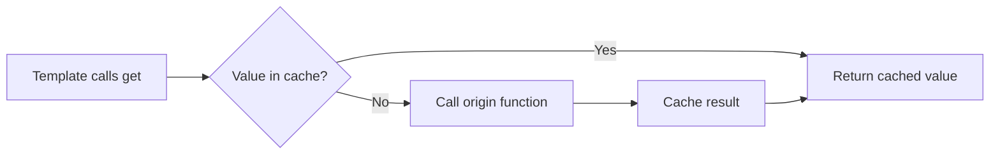
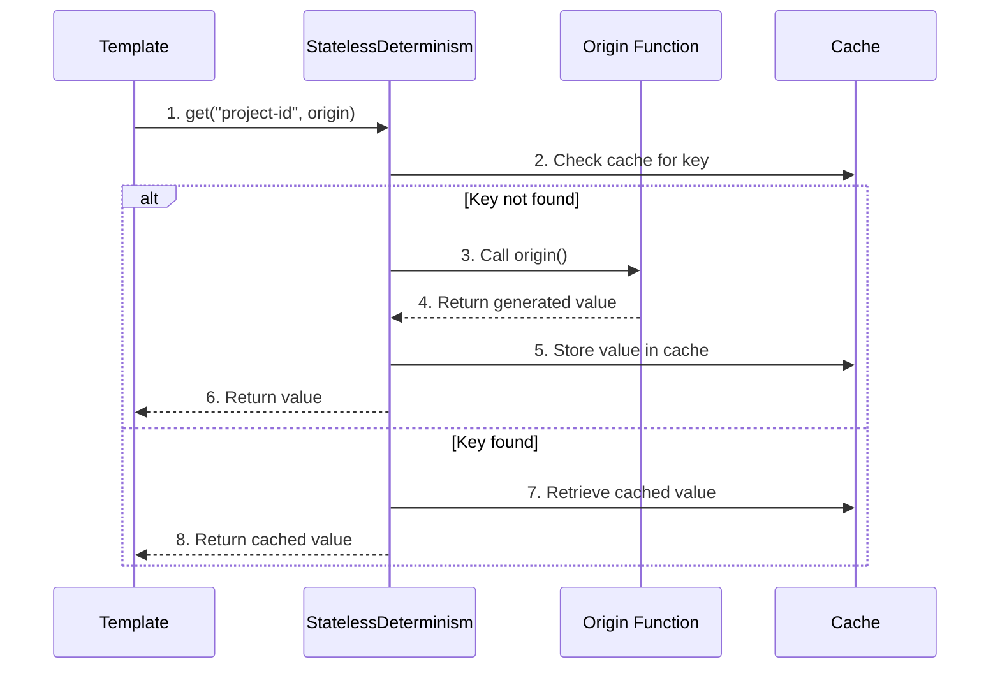

# Determinism

**What**: Caching mechanism for non-deterministic values (random numbers, dates, timestamps) that enables reproducible builds with the same template answers.

**Why**: Ensures that running the same template with the same answers produces identical output, even when the template uses random values or timestamps.

**Key Files**:
- `sdks/node/src/domain/core/deterministic.ts` → `IDeterminism` interface
- `sdks/node/src/domain/service/stateless_determinism.ts` → `StatelessDeterminism.get()`
- `sdks/python/cyanprintsdk/domain/core/deterministic.py` → `IDeterminism` class
- `sdks/python/cyanprintsdk/domain/service/stateless_determinism.py` → `StatelessDeterminism.get()`
- `sdks/dotnet/sulfone-helium/Domain/Core/Deterministic.cs` → `IDeterminism` interface
- `sdks/dotnet/sulfone-helium/Domain/Service/StatelessDeterminism.cs` → `Get()` method

## Overview

Determinism is the mechanism that makes template execution reproducible. When a template uses random values (e.g., for generating unique IDs) or timestamps (e.g., for copyright dates), these values would normally change on each execution, making builds non-reproducible.

The `IDeterminism` interface solves this by caching non-deterministic values using a hash-based key. The first time a particular key is requested, the origin function is called to generate the value. Subsequent requests with the same key return the cached value.

For example, when generating a unique project ID:
```typescript
const projectId = await determinism.get("project-id", () => randomUUID());
```

The first execution calls `randomUUID()` and caches the result. On subsequent executions (or when navigating back and retrying), the cached value is returned, ensuring the same project ID is used.

## Flow

### High-Level



### Detailed



| # | Step | What | Why | Key File |
|---|------|------|-----|----------|
| 1 | get("project-id", origin) | Template requests cached value | Begin determinism flow | `sdks/node/src/domain/core/deterministic.ts` → `get()` |
| 2 | Check cache for key | Look for existing cached value | Reuse if exists | `sdks/node/src/domain/service/stateless_determinism.ts` |
| 3 | Call origin() | Generate new value if not cached | First-time generation | User-provided function |
| 4 | Return generated value | Origin function returns value | Get value to cache | Origin function |
| 5 | Store value in cache | Save for future requests | Enable reproducibility | `sdks/node/src/domain/service/stateless_determinism.ts` |
| 6 | Return value | Return value to template | Provide generated value | `sdks/node/src/domain/service/stateless_determinism.ts` |
| 7 | Retrieve cached value | Get previously cached value | Reuse cached value | `sdks/node/src/domain/service/stateless_determinism.ts` |
| 8 | Return cached value | Return cached to template | Ensure reproducibility | `sdks/node/src/domain/service/stateless_determinism.ts` |

## Usage Examples

### Random Values

```typescript
// Generate a random port, cached for reproducibility
const port = await determinism.get("api-port", () => Math.floor(Math.random() * 10000) + 3000);
```

### Timestamps

```typescript
// Cache the current year for copyright notices
const year = await determinism.get("copyright-year", () => new Date().getFullYear().toString());
```

### Unique IDs

```typescript
// Generate a unique project ID
const projectId = await determinism.get("project-id", () => randomUUID());
```

## Deterministic State

The `deterministicStates` dictionary is passed between the coordinator and template in each request, containing:
- Key: The string key used in `get()` calls
- Value: The cached non-deterministic value

This state is preserved across checkpoint retries, ensuring that the same values are used when the user navigates back and changes answers.

## Related

- [Server-Client Prompting Concept](./01-server-client-prompting.md) - How checkpoints interact with determinism
- [Template API Feature](../features/01-template-api.md) - Interactive prompting with determinism
