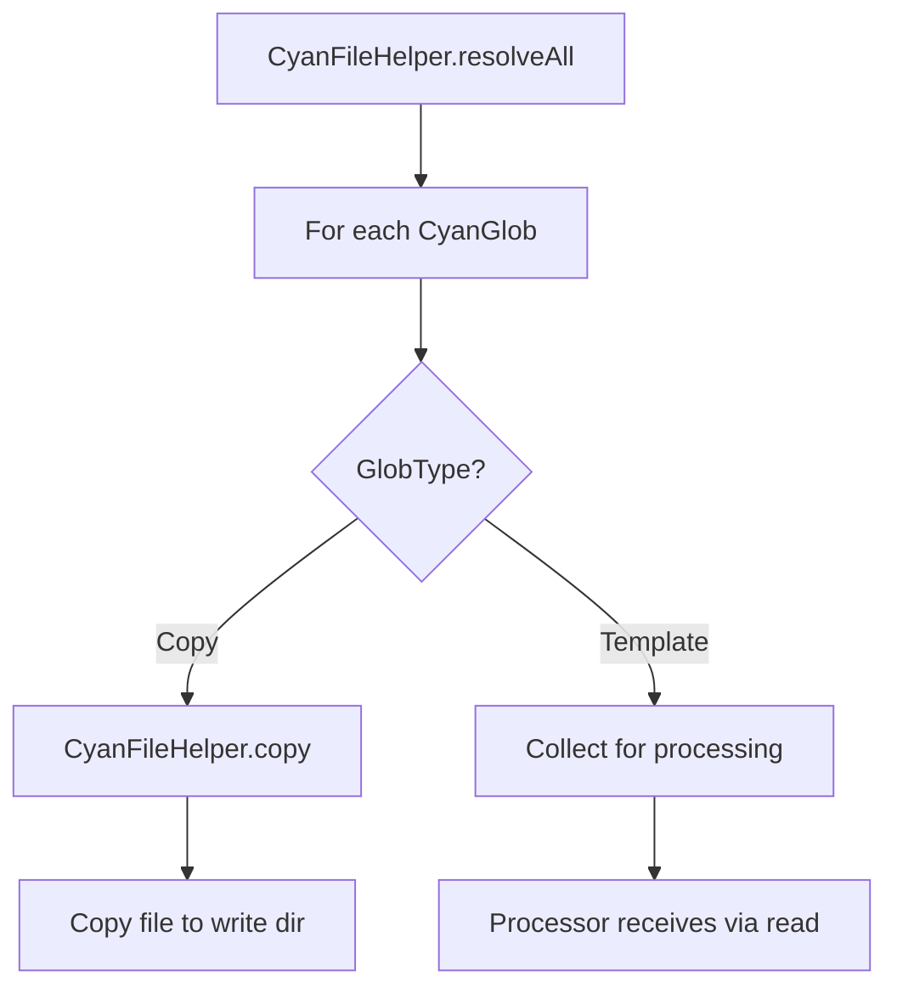

# GlobType

**What**: Enum that controls how files are handled - Template (0) files are processed by the processor, Copy (1) files are copied as-is without modification.

**Why**: Enables templates to mix files that need transformation (e.g., Handlebars templates) with files that should be copied directly (e.g., images, binaries).

**Key Files**:

- `sdks/node/src/domain/core/cyan.ts` → `GlobType` enum, `CyanGlob` type
- `sdks/python/cyanprintsdk/domain/core/cyan.py` → `GlobType` enum, `CyanGlob` class
- `sdks/dotnet/sulfone-helium/Domain/Core/Cyan.cs` → `GlobType` enum, `CyanGlob` class

## Overview

GlobType is an enum that determines how matched files are handled during processing:

- **Template (0)**: Files are read by the processor for transformation. These files are passed to the processor's `process()` method via `CyanFileHelper.read()`, allowing the processor to apply templating logic (e.g., variable substitution, code generation).

- **Copy (1)**: Files are copied directly without processing. These files are handled by `CyanFileHelper.copy()`, which simply copies files from the read directory to the write directory without any transformation.

This separation enables templates to include static assets (images, configuration files, binaries) alongside template files that need processing.

## Values

| Value | Name     | Description                                     |
| ----- | -------- | ----------------------------------------------- |
| 0     | Template | Files will be processed by the processor        |
| 1     | Copy     | Files will be copied as-is without modification |

## Flow



| Step          | What                          | Key File                                                          |
| ------------- | ----------------------------- | ----------------------------------------------------------------- |
| resolveAll    | Resolve all glob patterns     | `sdks/node/src/domain/core/fs/cyan_fs_helper.ts` → `resolveAll()` |
| Copy type     | Copy files without processing | `sdks/node/src/domain/core/fs/cyan_fs_helper.ts` → `copy()`       |
| Template type | Collect files for processor   | `sdks/node/src/domain/core/fs/cyan_fs_helper.ts` → `read()`       |

## Example

```typescript
const cyan: Cyan = {
  processors: [
    {
      name: 'handlebars',
      files: [
        // Template files - will be processed
        {
          glob: '**/*.hbs',
          root: './template',
          exclude: ['**/test/**'],
          type: GlobType.Template,
        },
        // Static files - will be copied as-is
        {
          glob: '**/*.png',
          root: './template/assets',
          type: GlobType.Copy,
        },
        // Config files - will be copied as-is
        {
          glob: '**/*.json',
          root: './template',
          type: GlobType.Copy,
        },
      ],
      config: {},
    },
  ],
  plugins: [],
};
```

In this example:

- `**/*.hbs` files are processed by the Handlebars processor
- `**/*.png` image files are copied directly
- `**/*.json` files are copied directly without modification

## Related

- [Cyan Config Concept](./02-cyan-config.md) - The output structure using CyanGlob
- [Processor API Feature](../features/02-processor-api.md) - File transformation with CyanFileHelper
