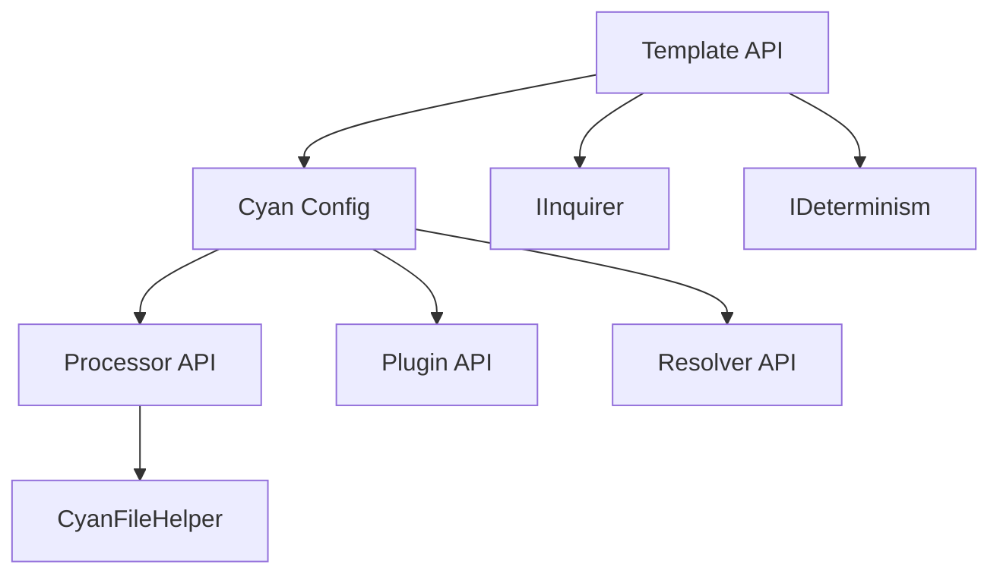

# Features Overview

This section covers the four core APIs exposed by the Helium SDKs: Template (interactive prompting), Processor (file transformation), Plugin (post-processing hooks), and Resolver (conflict resolution).

## Map

How items in this section relate:

| Item           | Role                                      |
| -------------- | ----------------------------------------- |
| Template API   | Interactive questioning → Cyan config     |
| Processor API  | File transformation based on Cyan config  |
| Plugin API     | Post-processing hooks after processing    |
| Resolver API   | Conflict resolution for multi-layer files |
| IInquirer      | 6 question types for prompting            |
| IDeterminism   | Cached non-deterministic values           |
| CyanFileHelper | Virtual file system for processors        |

## All Features

| Item                                   | What                                               | Why                                                             | Key Files                                   |
| -------------------------------------- | -------------------------------------------------- | --------------------------------------------------------------- | ------------------------------------------- |
| [Template API](./01-template-api.md)   | Interactive prompting for Cyan config generation   | Enables user input collection without server-side state         | `sdks/node/src/domain/template/service.ts`  |
| [Processor API](./02-processor-api.md) | File transformation engines                        | Apply templating logic to generate files                        | `sdks/node/src/domain/processor/service.ts` |
| [Plugin API](./03-plugin-api.md)       | Post-processing utilities                          | Add/remove/transform files after processing                     | `sdks/node/src/domain/plugin/service.ts`    |
| [Resolver API](./04-resolver-api.md)   | Conflict resolution for files from multiple layers | Merge files when multiple templates contribute to the same path | `sdks/node/src/domain/resolver/service.ts`  |

## Groups

### Group 1: Core APIs

- **[Template API](./01-template-api.md)** - Interactive prompting → Cyan config
- **[Processor API](./02-processor-api.md)** - File transformation
- **[Plugin API](./03-plugin-api.md)** - Post-processing hooks
- **[Resolver API](./04-resolver-api.md)** - Conflict resolution
