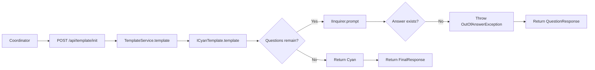
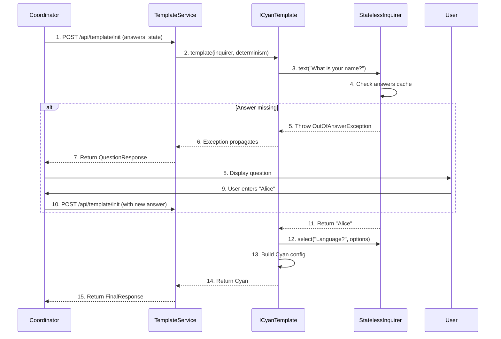

# Template API

**What**: Interactive questioning interface that collects user input through a checkpoint-based exception flow, producing a Cyan config as output.

**Why**: Enables templates to ask users questions without blocking or managing state on the server, supporting back navigation and multi-client interfaces.

**Key Files**:

- `sdks/node/src/domain/template/service.ts` → `TemplateService.template()`
- `sdks/node/src/domain/core/inquirer.ts` → `IInquirer` interface
- `sdks/node/src/domain/service/stateless_inquirer.ts` → `StatelessInquirer`
- `sdks/node/src/domain/service/stateless_determinism.ts` → `StatelessDeterminism`
- `sdks/node/src/api/template/lambda.ts` → `LambdaTemplate`
- `sdks/node/src/main.ts` → `StartTemplate()`, `StartTemplateWithLambda()`
- `sdks/python/cyanprintsdk/domain/template/service.py` → `TemplateService.template()`
- `sdks/python/cyanprintsdk/domain/core/inquirer.py` → `IInquirer` class
- `sdks/python/cyanprintsdk/main.py` → `start_template()`, `start_template_with_fn()`
- `sdks/dotnet/sulfone-helium/Domain/Template/Service.cs` → `Template()`
- `sdks/dotnet/sulfone-helium/Domain/Core/Inquirer.cs` → `IInquirer` interface
- `sdks/dotnet/sulfone-helium/Server.cs` → `StartTemplate()`

## Overview

The Template API enables interactive question-based prompting to collect user input. Templates use the `IInquirer` interface to ask questions, which throws `OutOfAnswerException` when answers are missing. The coordinator catches this exception, prompts the user, and retries with the accumulated answers.

The template's output is a `Cyan` config object that defines processors and plugins for file generation. The template also receives an `IDeterminism` interface for caching non-deterministic values (random numbers, dates) to ensure reproducible builds.

## Flow

### High-Level

### Detailed

| #   | Step                            | What                                    | Why                       | Key File                                              |
| --- | ------------------------------- | --------------------------------------- | ------------------------- | ----------------------------------------------------- |
| 1   | POST /api/template/init         | Coordinator sends accumulated answers   | Initiate checkpoint flow  | `sdks/node/src/main.ts`                               |
| 2   | template(inquirer, determinism) | Service calls template with interfaces  | Begin template execution  | `sdks/node/src/domain/template/service.ts`            |
| 3   | text("What is your name?")      | Template prompts for input              | Collect user answer       | `sdks/node/src/domain/core/inquirer.ts`               |
| 4   | Check answers cache             | Inquirer looks for cached answer        | Reuse if exists           | `sdks/node/src/domain/service/stateless_inquirer.ts`  |
| 5   | Throw OutOfAnswerException      | Signal that answer is needed            | Non-blocking checkpoint   | `sdks/node/src/domain/service/out_of_answer_error.ts` |
| 6   | Exception propagates            | Exception bubbles to service            | Signal coordinator        | `sdks/node/src/domain/template/service.ts`            |
| 7   | Return QuestionResponse         | Service returns question to coordinator | Prompt user               | `sdks/node/src/api/template/res.ts`                   |
| 8   | Display question                | Coordinator shows UI                    | Collect user input        | Coordinator                                           |
| 9   | User enters answer              | User provides input                     | Get answer for retry      | UI                                                    |
| 10  | POST with new answer            | Coordinator resends all answers         | Retry checkpoint          | `sdks/node/src/main.ts`                               |
| 11  | Return "Alice"                  | Inquirer returns cached value           | Continue execution        | `sdks/node/src/domain/service/stateless_inquirer.ts`  |
| 12  | select("Language?", options)    | Template prompts for selection          | Collect more input        | `sdks/node/src/domain/core/inquirer.ts`               |
| 13  | Build Cyan config               | Template creates output config          | Define processors/plugins | `sdks/node/src/domain/core/cyan.ts`                   |
| 14  | Return Cyan                     | Template returns final config           | Complete execution        | `sdks/node/src/domain/template/service.ts`            |
| 15  | Return FinalResponse            | Service returns final config            | Signal completion         | `sdks/node/src/api/template/res.ts`                   |

## IInquirer Interface

The `IInquirer` interface provides 6 question types:

| Method         | Question Type | Return Type                             | Parameters                 |
| -------------- | ------------- | --------------------------------------- | -------------------------- |
| `text()`       | TextQ         | `Promise<string>`                       | message, id, help          |
| `password()`   | PasswordQ     | `Promise<string>`                       | message, id, help          |
| `confirm()`    | ConfirmQ      | `Promise<boolean>`                      | message, id, help          |
| `select()`     | SelectQ       | `Promise<string>`                       | message, options, id, help |
| `checkbox()`   | CheckboxQ     | `Promise<string[]>`                     | message, options, id, help |
| `dateSelect()` | DateQ         | `Promise<string>` / `Promise<DateOnly>` | message, id, help          |

**Key Files**:

- Node: `sdks/node/src/domain/core/inquirer.ts`
- Python: `sdks/python/cyanprintsdk/domain/core/inquirer.py`
- .NET: `sdks/dotnet/sulfone-helium/Domain/Core/Inquirer.cs`

## IDeterminism Interface

The `IDeterminism` interface provides cached non-deterministic values:

| Method             | Description                              |
| ------------------ | ---------------------------------------- |
| `get(key, origin)` | Get cached value or call origin function |

**Key Files**:

- Node: `sdks/node/src/domain/core/deterministic.ts`
- Python: `sdks/python/cyanprintsdk/domain/core/deterministic.py`
- .NET: `sdks/dotnet/sulfone-helium/Domain/Core/Deterministic.cs`

## Entry Points

| SDK    | Interface Method                | Lambda Method                                              |
| ------ | ------------------------------- | ---------------------------------------------------------- |
| Node   | `StartTemplate(ICyanTemplate)`  | `StartTemplateWithLambda(LambdaTemplateFn)`                |
| Python | `start_template(ICyanTemplate)` | `start_template_with_fn(LambdaTemplateFn)`                 |
| .NET   | `StartTemplate(ICyanTemplate)`  | `StartTemplate(Func<IInquirer, IDeterminism, Task<Cyan>>)` |

**Key Files**:

- Node: `sdks/node/src/main.ts`
- Python: `sdks/python/cyanprintsdk/main.py`
- .NET: `sdks/dotnet/sulfone-helium/Server.cs`

## Edge Cases

- **Validation errors**: Validation returns error message but doesn't throw; template continues with same question
- **Back navigation**: Coordinator removes answers from that point forward and retries with earlier state
- **Determinism**: Deterministic state is preserved across retries

## Related

- [Server-Client Prompting Concept](../concepts/01-server-client-prompting.md) - Checkpoint-based exception flow
- [Cyan Config Concept](../concepts/02-cyan-config.md) - The output structure
- [Determinism Concept](../concepts/03-determinism.md) - Cached non-deterministic values
- [Processor API Feature](./02-processor-api.md) - File transformation using template output
