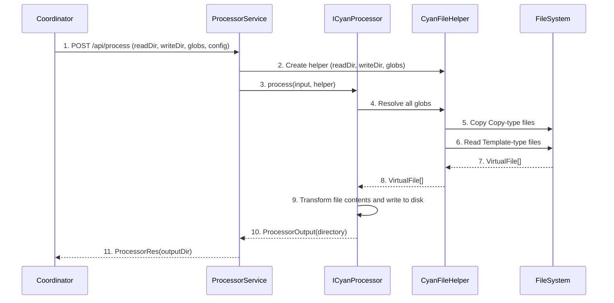

# Processor API

**What**: File transformation interface that reads template files, applies templating logic, and outputs processed files.

**Why**: Enables processors to transform files using glob patterns, supporting container isolation and language-independent file operations.

**Key Files**:
- `sdks/node/src/domain/processor/service.ts` → `ProcessorService.process()`
- `sdks/node/src/domain/core/cyan_script.ts` → `ICyanProcessor` interface
- `sdks/node/src/domain/core/fs/cyan_fs_helper.ts` → `CyanFileHelper`
- `sdks/node/src/api/processor/lambda.ts` → `LambdaProcessor`
- `sdks/node/src/main.ts` → `StartProcessor()`, `StartProcessorWithLambda()`
- `sdks/python/cyanprintsdk/domain/processor/service.py` → `ProcessorService.process()`
- `sdks/python/cyanprintsdk/main.py` → `start_processor()`, `start_processor_with_fn()`
- `sdks/dotnet/sulfone-helium/Domain/Processor/Service.cs` → `Process()`
- `sdks/dotnet/sulfone-helium/Server.cs` → `StartProcessor()`

## Overview

The Processor API enables file transformation engines to process template files. Processors receive a `CyanProcessorInput` containing the read/write directories, glob patterns, and configuration. They use `CyanFileHelper` to read files matching glob patterns and return processed files via `ProcessorOutput`.

Processors support two file handling modes via `GlobType`:
- **Template (0)**: Files are read for transformation
- **Copy (1)**: Files are copied directly without processing

The `CyanFileHelper` provides a virtual file system abstraction, enabling container isolation and language-independent file operations.

## Flow

### High-Level


### Detailed



| # | Step | What | Why | Key File |
|---|------|------|-----|----------|
| 1 | POST /api/process | Coordinator sends processing request | Initiate processing | `sdks/node/src/main.ts` |
| 2 | Create helper | Service creates file helper | Initialize file operations | `sdks/node/src/domain/processor/service.ts` |
| 3 | process(input, helper) | Service calls processor with helper | Begin processing | `sdks/node/src/domain/core/cyan_script.ts` |
| 4 | Resolve all globs | Processor resolves file patterns | Get files to process | `sdks/node/src/domain/core/fs/cyan_fs_helper.ts` |
| 5 | Copy Copy-type files | Helper copies files as-is | Handle static files | `sdks/node/src/domain/core/fs/cyan_fs_helper.ts` → `copy()` |
| 6 | Read Template-type files | Helper reads files for processing | Get files to transform | `sdks/node/src/domain/core/fs/cyan_fs_helper.ts` → `read()` |
| 7 | VirtualFile[] | Returns virtual file array | Language-independent representation | `sdks/node/src/domain/core/fs/virtual_file.ts` |
| 8 | VirtualFile[] | Processor receives files | Begin transformation | `sdks/node/src/domain/core/cyan_script.ts` |
| 9 | Transform and write | Processor applies logic and writes files | Generate output in write directory | Processor implementation |
| 10 | ProcessorOutput(directory) | Processor returns output directory | Complete processing | `sdks/node/src/domain/processor/output.ts` |
| 11 | ProcessorRes(outputDir) | Service maps to response | Return to coordinator | `sdks/node/src/api/processor/res.ts` |

## CyanFileHelper Interface

The `CyanFileHelper` interface provides file operations:

| Method | Description | Returns |
|--------|-------------|---------|
| `resolveAll()` | Resolve all globs and copy Copy-type files | `VirtualFile[]` |
| `read(glob)` | Read files matching glob pattern | `VirtualFile[]` |
| `copy(glob)` | Copy files matching glob as-is | `void` |
| `CopyFile(from, to)` | Copy single file | `void` |

**Key Files**:
- Node: `sdks/node/src/domain/core/fs/cyan_fs_helper.ts`
- Python: `sdks/python/cyanprintsdk/domain/core/fs/cyan_fs_helper.py`
- .NET: `sdks/dotnet/sulfone-helium/Domain/Core/FileSystem/CyanFileHelper.cs`

## ICyanProcessor Interface

```typescript
interface ICyanProcessor {
  process(input: CyanProcessorInput, fileHelper: CyanFileHelper): Promise<ProcessorOutput>;
}
```

**Key Files**:
- Node: `sdks/node/src/domain/core/cyan_script.ts`
- Python: `sdks/python/cyanprintsdk/domain/core/cyan_script.py`
- .NET: `sdks/dotnet/sulfone-helium/Domain/Core/CyanScript.cs`

## CyanProcessorInput

| Field | Type | Description |
|-------|------|-------------|
| readDir | `string` | Directory to read files from |
| writeDir | `string` | Directory to write files to |
| globs | `CyanGlob[]` | Glob patterns for file matching |
| config | `dynamic` | Processor-specific configuration |

## ProcessorOutput

| Field | Type | Description |
|-------|------|-------------|
| directory | `string` | Output directory containing processed files |

## Entry Points

| SDK | Interface Method | Lambda Method |
|-----|------------------|---------------|
| Node | `StartProcessor(ICyanProcessor)` | `StartProcessorWithLambda(LambdaProcessorFn)` |
| Python | `start_processor(ICyanProcessor)` | `start_processor_with_fn(LambdaProcessorFn)` |
| .NET | `StartProcessor(ICyanProcessor)` | `StartProcessor(Func<CyanProcessorInput, CyanFileHelper, Task<ProcessorOutput>>)` |

**Key Files**:
- Node: `sdks/node/src/main.ts`
- Python: `sdks/python/cyanprintsdk/main.py`
- .NET: `sdks/dotnet/sulfone-helium/Server.cs`

## Edge Cases

- **Empty globs**: No files matched, returns empty output
- **Exclude patterns**: Files matching exclude patterns are skipped
- **Large files**: Streamed via `VirtualFileStream` for memory efficiency

## Related

- [GlobType Concept](../concepts/04-globtype.md) - Template vs Copy file handling
- [Cyan Config Concept](../concepts/02-cyan-config.md) - Processor configuration from template
