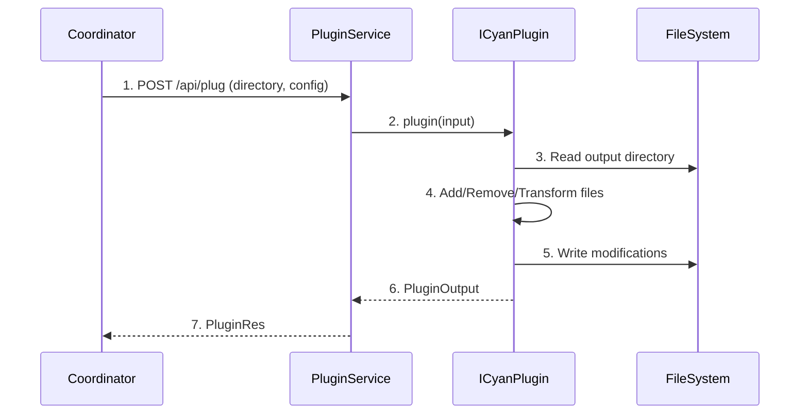

# Plugin API

**What**: Post-processing interface that runs after all processors complete, enabling plugins to add, remove, or transform files.

**Why**: Enables post-processing tasks like cleanup, formatting, or file addition after the main file generation is complete.

**Key Files**:

- `sdks/node/src/domain/plugin/service.ts` → `PluginService.plug()`
- `sdks/node/src/domain/core/cyan_script.ts` → `ICyanPlugin` interface
- `sdks/node/src/api/plugin/lambda.ts` → `LambdaPlugin`
- `sdks/node/src/main.ts` → `StartPlugin()`, `StartPluginWithLambda()`
- `sdks/python/cyanprintsdk/domain/plugin/service.py` → `PluginService.plug()`
- `sdks/python/cyanprintsdk/main.py` → `start_plugin()`, `start_plugin_with_fn()`
- `sdks/dotnet/sulfone-helium/Domain/Plugin/Service.cs` → `Plug()`
- `sdks/dotnet/sulfone-helium/Server.cs` → `StartPlugin()`

## Overview

The Plugin API enables post-processing utilities to modify the output from processors. Plugins run after all processors have completed and receive a `CyanPluginInput` containing the output directory and configuration.

Plugins can perform three types of operations:

- **Add**: Insert new files (e.g., .gitignore, LICENSE)
- **Remove**: Delete files (e.g., template files, temporary files)
- **Transform**: Modify existing files (e.g., format code, update imports)

Unlike processors, plugins do not use glob patterns - they operate on the entire output directory.

## Flow

### High-Level


### Detailed



| #   | Step                  | What                             | Why                    | Key File                                   |
| --- | --------------------- | -------------------------------- | ---------------------- | ------------------------------------------ |
| 1   | POST /api/plug        | Coordinator sends plugin request | Initiate plugin        | `sdks/node/src/main.ts`                    |
| 2   | plugin(input)         | Service calls plugin with input  | Begin plugin execution | `sdks/node/src/domain/core/cyan_script.ts` |
| 3   | Read output directory | Plugin reads generated files     | Access output          | Plugin implementation                      |
| 4   | Add/Remove/Transform  | Plugin modifies files            | Apply post-processing  | Plugin implementation                      |
| 5   | Write modifications   | Plugin writes changes            | Update output          | Plugin implementation                      |
| 6   | PluginOutput          | Plugin returns output            | Complete execution     | `sdks/node/src/domain/plugin/output.ts`    |
| 7   | PluginRes             | Service maps to response         | Return to coordinator  | `sdks/node/src/api/plugin/res.ts`          |

## ICyanPlugin Interface

```typescript
interface ICyanPlugin {
  plugin(input: CyanPluginInput): Promise<PluginOutput>;
}
```

**Key Files**:

- Node: `sdks/node/src/domain/core/cyan_script.ts`
- Python: `sdks/python/cyanprintsdk/domain/core/cyan_script.py`
- .NET: `sdks/dotnet/sulfone-helium/Domain/Core/CyanScript.cs`

## CyanPluginInput

| Field     | Type      | Description                                 |
| --------- | --------- | ------------------------------------------- |
| directory | `string`  | Output directory containing processed files |
| config    | `dynamic` | Plugin-specific configuration               |

## PluginOutput

| Field     | Type     | Description                                 |
| --------- | -------- | ------------------------------------------- |
| directory | `string` | Output directory containing processed files |

## Entry Points

| SDK    | Interface Method            | Lambda Method                                            |
| ------ | --------------------------- | -------------------------------------------------------- |
| Node   | `StartPlugin(ICyanPlugin)`  | `StartPluginWithLambda(LambdaPluginFn)`                  |
| Python | `start_plugin(ICyanPlugin)` | `start_plugin_with_fn(LambdaPluginFn)`                   |
| .NET   | `StartPlugin(ICyanPlugin)`  | `StartPlugin(Func<CyanPluginInput, Task<PluginOutput>>)` |

**Key Files**:

- Node: `sdks/node/src/main.ts`
- Python: `sdks/python/cyanprintsdk/main.py`
- .NET: `sdks/dotnet/sulfone-helium/Server.cs`

## Plugin Operations

### Add

Insert new files into the output:

```typescript
// Add .gitignore
await fs.writeFile(path.join(directory, '.gitignore'), content);
```

### Remove

Delete files from the output:

```typescript
// Remove template files
await fs.unlink(path.join(directory, 'template.hbs'));
```

### Transform

Modify existing files:

```typescript
// Format code with Prettier
const content = await fs.readFile(path.join(directory, 'index.ts'), 'utf-8');
const formatted = await prettier.format(content, { parser: 'typescript' });
await fs.writeFile(path.join(directory, 'index.ts'), formatted);
```

## Edge Cases

- **Missing directory**: Plugin handles gracefully if directory doesn't exist
- **Empty output**: Plugin works with empty output directories
- **Conflicting plugins**: Plugins run sequentially; later plugins see earlier plugin changes

## Related

- [Template API Feature](./01-template-api.md) - Plugin configuration from template
- [Processor API Feature](./02-processor-api.md) - Files that plugins process
