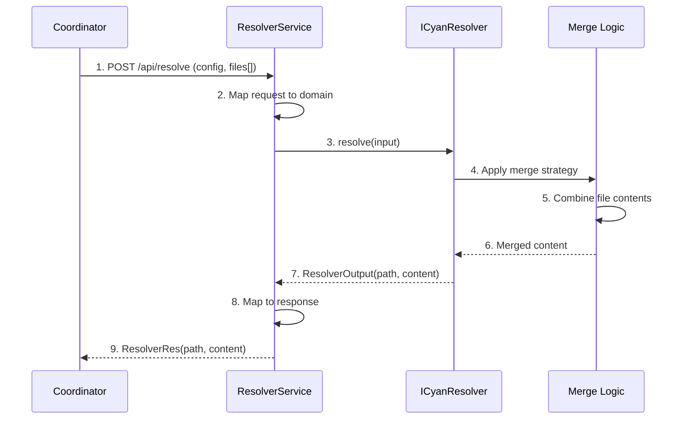

# Resolver API

**What**: Conflict resolution interface that receives multiple versions of the same file from different template layers and returns merged content.

**Why**: Enables resolvers to implement custom merge strategies (JSON merge, YAML merge, etc.) when files conflict across template layers.

**Key Files**:

- `sdks/node/src/domain/resolver/service.ts` → `ResolverService.resolve()`
- `sdks/node/src/domain/core/cyan_script.ts` → `ICyanResolver` interface
- `sdks/node/src/api/resolver/lambda.ts` → `LambdaResolver`
- `sdks/node/src/api/resolver/mapper.ts` → `ResolverMapper`
- `sdks/node/src/main.ts` → `StartResolver()`, `StartResolverWithLambda()`
- `sdks/python/cyanprintsdk/domain/resolver/service.py` → `ResolverService.resolve()`
- `sdks/python/cyanprintsdk/main.py` → `start_resolver()`, `start_resolver_with_fn()`
- `sdks/dotnet/sulfone-helium/Domain/Resolver/Service.cs` → `Resolve()`
- `sdks/dotnet/sulfone-helium/Server.cs` → `StartResolver()`

## Overview

The Resolver API enables stateless conflict resolution services on port 5553. Resolvers receive multiple versions of the same file from different template layers and return merged content. This is useful when multiple templates contribute to the same file (e.g., `package.json` from frontend and backend templates).

Resolvers are **stateless** - they receive file content directly in the request and return merged content in the response. No file system access is required.

## Flow

### High-Level


### Detailed



| #   | Step                  | What                                    | Why                          | Key File                                   |
| --- | --------------------- | --------------------------------------- | ---------------------------- | ------------------------------------------ |
| 1   | POST /api/resolve     | Coordinator sends resolution request    | Initiate conflict resolution | `sdks/node/src/main.ts`                    |
| 2   | Map request to domain | Mapper converts API types to domain     | Clean separation of concerns | `sdks/node/src/api/resolver/mapper.ts`     |
| 3   | resolve(input)        | Service calls resolver                  | Begin resolution             | `sdks/node/src/domain/resolver/service.ts` |
| 4   | Apply merge strategy  | Resolver applies config-driven strategy | Configurable merge behavior  | Resolver implementation                    |
| 5   | Combine file contents | Merge multiple file versions            | Resolve conflicts            | Resolver implementation                    |
| 6   | Merged content        | Strategy returns combined content       | Output ready                 | Resolver implementation                    |
| 7   | ResolverOutput        | Resolver returns output                 | Complete resolution          | `sdks/node/src/domain/resolver/output.ts`  |
| 8   | Map to response       | Mapper converts domain to API types     | Return to coordinator        | `sdks/node/src/api/resolver/mapper.ts`     |
| 9   | ResolverRes           | Service returns response                | Complete request             | `sdks/node/src/api/resolver/res.ts`        |

## ICyanResolver Interface

```typescript
interface ICyanResolver {
  resolve(input: ResolverInput): Promise<ResolverOutput>;
}
```

**Key Files**:

- Node: `sdks/node/src/domain/core/cyan_script.ts`
- Python: `sdks/python/cyanprintsdk/domain/core/cyan_script.py`
- .NET: `sdks/dotnet/sulfone-helium/Domain/Core/CyanScript.cs`

## Types

### ResolverInput

| Field  | Type                      | Description                                            |
| ------ | ------------------------- | ------------------------------------------------------ |
| config | `Record<string, unknown>` | Resolver-specific configuration (e.g., merge strategy) |
| files  | `ResolvedFile[]`          | Array of file versions from different layers           |

### ResolvedFile

| Field   | Type         | Description                           |
| ------- | ------------ | ------------------------------------- |
| path    | `string`     | File path (same for all versions)     |
| content | `string`     | File content                          |
| origin  | `FileOrigin` | Source template and layer information |

### FileOrigin

| Field    | Type     | Description                                            |
| -------- | -------- | ------------------------------------------------------ |
| template | `string` | Full template spec (e.g., "username/template:version") |
| layer    | `number` | Layer number in the template stack                     |

### ResolverOutput

| Field   | Type     | Description         |
| ------- | -------- | ------------------- |
| path    | `string` | File path           |
| content | `string` | Merged file content |

## Entry Points

| SDK    | Interface Method                | Lambda Method                                              |
| ------ | ------------------------------- | ---------------------------------------------------------- |
| Node   | `StartResolver(ICyanResolver)`  | `StartResolverWithLambda(LambdaResolverFn)`                |
| Python | `start_resolver(ICyanResolver)` | `start_resolver_with_fn(LambdaResolverFn)`                 |
| .NET   | `StartResolver(ICyanResolver)`  | `StartResolver(Func<ResolverInput, Task<ResolverOutput>>)` |

**Key Files**:

- Node: `sdks/node/src/main.ts`
- Python: `sdks/python/cyanprintsdk/main.py`
- .NET: `sdks/dotnet/sulfone-helium/Server.cs`

## Edge Cases

- **Single file**: If only one file version is provided, return it as-is
- **Empty files array**: Return empty output (should not happen in practice)
- **Large files**: Content is passed as strings; consider streaming for very large files
- **Binary files**: Content is base64-encoded; resolver must handle decoding

## Related

- [Template API](./01-template-api.md) - Generates Cyan config
- [Processor API](./02-processor-api.md) - File transformation
- [Plugin API](./03-plugin-api.md) - Post-processing hooks
- [Resolver HTTP API](../surfaces/api/04-resolver-api.md) - HTTP endpoint details
