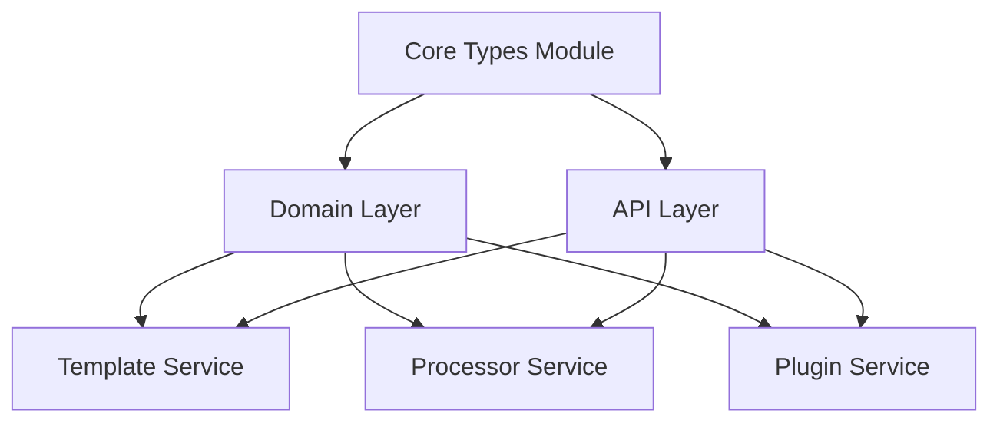

# Modules Overview

This section covers the three main modules of the Helium SDK architecture: Core Types (shared interfaces), Domain Layer (business logic services), and API Layer (HTTP endpoints).

## Map

How items in this section relate:

| Item              | Role                                                  |
| ----------------- | ----------------------------------------------------- |
| Core Types Module | Shared types and interfaces (Cyan, IInquirer, etc.)   |
| Domain Layer      | Business logic services (Template, Processor, Plugin) |
| API Layer         | HTTP endpoints and DTOs                               |

## All Modules

| Item                                 | What                                                    | Why                                                                | Key Files                    |
| ------------------------------------ | ------------------------------------------------------- | ------------------------------------------------------------------ | ---------------------------- |
| [Core Types](./01-core-types.md)     | Shared types and interfaces across all SDKs             | Provides common data structures for templates, processors, plugins | `sdks/node/src/domain/core/` |
| [Domain Layer](./02-domain-layer.md) | Business logic for Template, Processor, Plugin services | Implements core functionality for each API                         | `sdks/node/src/domain/*/`    |
| [API Layer](./03-api-layer.md)       | HTTP endpoints and DTOs for all services                | Exposes services via HTTP protocol                                 | `sdks/node/src/api/`         |

## Groups

### Group 1: Core

- **[Core Types](./01-core-types.md)** - Shared types and interfaces

### Group 2: Services

- **[Domain Layer](./02-domain-layer.md)** - Business logic services

### Group 3: HTTP

- **[API Layer](./03-api-layer.md)** - HTTP endpoints and DTOs
