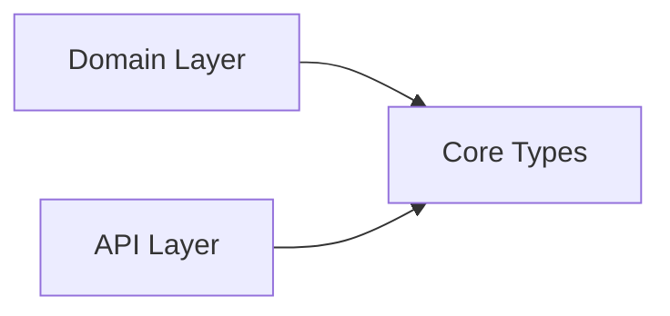

# Core Types Module

**What**: Shared types and interfaces used across Template, Processor, and Plugin APIs.

**Why**: Provides common data structures that enable consistent interaction between templates, processors, and plugins across all SDK languages.

**Key Files**:

- `sdks/node/src/domain/core/cyan_script.ts` - ICyanTemplate, ICyanProcessor, ICyanPlugin
- `sdks/node/src/domain/core/cyan.ts` - Cyan, CyanGlob, GlobType
- `sdks/node/src/domain/core/cyan_script_model.ts` - CyanProcessorInput, CyanPluginInput
- `sdks/node/src/domain/core/inquirer.ts` - IInquirer interface
- `sdks/node/src/domain/core/deterministic.ts` - IDeterminism interface
- `sdks/node/src/domain/core/question.ts` - Question types (TextQ, SelectQ, etc.)
- `sdks/node/src/domain/core/answer.ts` - Answer types
- `sdks/node/src/domain/core/fs/` - Virtual file system types
- `sdks/python/cyanprintsdk/domain/core/` - Python equivalents
- `sdks/dotnet/sulfone-helium/Domain/Core/` - .NET equivalents

## Responsibilities

What this module is responsible for:

- Defining core interfaces (ICyanTemplate, ICyanProcessor, ICyanPlugin)
- Providing shared data structures (Cyan, CyanGlob, CyanProcessorInput, CyanPluginInput)
- Specifying question types for interactive prompting
- Virtual file system abstraction (VirtualFile, CyanFileHelper)
- Answer and deterministic state types

## Structure

```text
domain/core/
├── cyan_script.ts          # Core interfaces (ICyanTemplate, ICyanProcessor, ICyanPlugin)
├── cyan.ts                 # Cyan config types (Cyan, CyanProcessor, CyanPlugin, CyanGlob)
├── cyan_script_model.ts    # Input types (CyanProcessorInput, CyanPluginInput)
├── inquirer.ts             # IInquirer interface for prompting
├── deterministic.ts        # IDeterminism interface for caching
├── question.ts             # Question types (TextQ, SelectQ, ConfirmQ, etc.)
├── answer.ts               # Answer types matching question types
└── fs/
    ├── cyan_fs_helper.ts   # Virtual file system helper
    └── virtual_file.ts     # Virtual file representation
```

| File                   | Purpose                                                        |
| ---------------------- | -------------------------------------------------------------- |
| `cyan_script.ts`       | Core interfaces defining Template, Processor, Plugin contracts |
| `cyan.ts`              | Output structure from templates (Cyan config)                  |
| `cyan_script_model.ts` | Input structures for processors and plugins                    |
| `inquirer.ts`          | Interface for interactive prompting (6 question types)         |
| `deterministic.ts`     | Interface for caching non-deterministic values                 |
| `question.ts`          | Question type definitions                                      |
| `answer.ts`            | Answer type definitions                                        |
| `fs/cyan_fs_helper.ts` | Virtual file system abstraction                                |
| `fs/virtual_file.ts`   | Virtual file data structure                                    |

## Dependencies

Core Types is a foundational module with no upstream dependencies.



| Consumer     | Why                                                  |
| ------------ | ---------------------------------------------------- |
| Domain Layer | Implements business logic using core type interfaces |
| API Layer    | Maps HTTP requests/responses to core types           |

## Key Interfaces

### ICyanTemplate

```typescript
interface ICyanTemplate {
  template(inquirer: IInquirer, determinism: IDeterminism): Promise<Cyan>;
}
```

**Key File**: `sdks/node/src/domain/core/cyan_script.ts`

### ICyanProcessor

```typescript
interface ICyanProcessor {
  process(input: CyanProcessorInput, fileHelper: CyanFileHelper): Promise<ProcessorOutput>;
}
```

**Key File**: `sdks/node/src/domain/core/cyan_script.ts`

### ICyanPlugin

```typescript
interface ICyanPlugin {
  plugin(input: CyanPluginInput): Promise<PluginOutput>;
}
```

**Key File**: `sdks/node/src/domain/core/cyan_script.ts`

### IInquirer

```typescript
interface IInquirer {
  text(q: string | TextQ, id?: string, help?: string | null): Promise<string>;
  password(q: string | PasswordQ, id?: string, help?: string | null): Promise<string>;
  confirm(q: string | ConfirmQ, id?: string, help?: string | null): Promise<boolean>;
  select(q: string | SelectQ, options?: string[], id?: string, help?: string | null): Promise<string>;
  checkbox(q: string | CheckboxQ, options?: string[], id?: string, help?: string | null): Promise<string[]>;
  dateSelect(q: string | DateQ, id?: string, help?: string | null): Promise<string>;
}
```

**Key File**: `sdks/node/src/domain/core/inquirer.ts`

### IDeterminism

```typescript
interface IDeterminism {
  get(key: string, origin: () => string): string;
}
```

**Key File**: `sdks/node/src/domain/core/deterministic.ts`

## Related

- [Domain Layer Module](./02-domain-layer.md) - Services using these interfaces
- [API Layer Module](./03-api-layer.md) - HTTP endpoints mapping to these types
- [Cyan Config Concept](../concepts/02-cyan-config.md) - Cyan structure explanation
