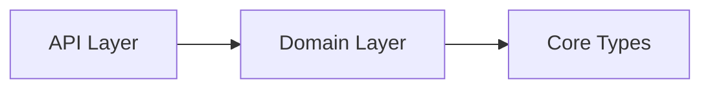

# Domain Layer Module

**What**: Business logic services for Template, Processor, and Plugin APIs.

**Why**: Implements core functionality for each API, handling checkpoint flow, file operations, and post-processing logic.

**Key Files**:

- `sdks/node/src/domain/template/service.ts` → `TemplateService`
- `sdks/node/src/domain/processor/service.ts` → `ProcessorService`
- `sdks/node/src/domain/plugin/service.ts` → `PluginService`
- `sdks/node/src/domain/service/stateless_inquirer.ts` → `StatelessInquirer`
- `sdks/node/src/domain/service/stateless_determinism.ts` → `StatelessDeterminism`
- `sdks/node/src/domain/service/out_of_answer_error.ts` → `OutOfAnswerException`
- `sdks/python/cyanprintsdk/domain/*/` - Python equivalents
- `sdks/dotnet/sulfone-helium/Domain/` - .NET equivalents

## Responsibilities

What this module is responsible for:

- Template service: Checkpoint-based question flow, validation
- Processor service: File transformation orchestration
- Plugin service: Post-processing orchestration
- Stateless implementations: Inquirer, Determinism
- Checkpoint exception: OutOfAnswerException

## Structure

```
domain/
├── template/
│   ├── service.ts          # TemplateService
│   ├── input.ts            # TemplateInput, TemplateValidateInput
│   └── output.ts           # TemplateOutput, TemplateFinalOutput, TemplateQnAOutput
├── processor/
│   ├── service.ts          # ProcessorService
│   ├── input.ts            # ProcessorInput
│   └── output.ts           # ProcessorOutput
├── plugin/
│   ├── service.ts          # PluginService
│   ├── input.ts            # PluginInput
│   └── output.ts           # PluginOutput
└── service/
    ├── stateless_inquirer.ts   # StatelessInquirer
    ├── stateless_determinism.ts # StatelessDeterminism
    └── out_of_answer_error.ts   # OutOfAnswerException
```

| File                               | Purpose                                     |
| ---------------------------------- | ------------------------------------------- |
| `template/service.ts`              | Template checkpoint flow and validation     |
| `processor/service.ts`             | Processor file transformation orchestration |
| `plugin/service.ts`                | Plugin post-processing orchestration        |
| `service/stateless_inquirer.ts`    | Stateless inquirer implementation           |
| `service/stateless_determinism.ts` | Stateless determinism implementation        |
| `service/out_of_answer_error.ts`   | Checkpoint exception                        |

## Dependencies



| Dependency | Why                                            |
| ---------- | ---------------------------------------------- |
| Core Types | Domain services implement core type interfaces |

| Dependent | Why                                               |
| --------- | ------------------------------------------------- |
| API Layer | API layer uses domain services for business logic |

## Key Services

### TemplateService

Implements checkpoint-based question flow:

```typescript
class TemplateService {
  async template(answer: TemplateInput): Promise<TemplateOutput>;
  async validate(answer: TemplateValidateInput): Promise<string | null>;
}
```

**Key File**: `sdks/node/src/domain/template/service.ts`

**Methods**:

- `template()`: Executes template with answers, returns final output or next question
- `validate()`: Validates user input for current question

### ProcessorService

Orchestrates file transformation:

```typescript
class ProcessorService {
  async process(input: ProcessorInput): Promise<ProcessorOutput>;
}
```

**Key File**: `sdks/node/src/domain/processor/service.ts`

**Methods**:

- `process()`: Creates CyanFileHelper and calls processor

### PluginService

Orchestrates post-processing:

```typescript
class PluginService {
  async plug(input: PluginInput): Promise<PluginOutput>;
}
```

**Key File**: `sdks/node/src/domain/plugin/service.ts`

**Methods**:

- `plug()`: Calls plugin with directory and config

## Stateless Implementations

### StatelessInquirer

Implements IInquirer with answer caching:

```typescript
class StatelessInquirer implements IInquirer {
  constructor(private answers: Record<string, Answer>) {}
  // All question methods check answers cache
}
```

**Key File**: `sdks/node/src/domain/service/stateless_inquirer.ts`

### StatelessDeterminism

Implements IDeterminism with value caching:

```typescript
class StatelessDeterminism implements IDeterminism {
  get(key: string, origin: () => string): string {
    // Check cache, call origin if not found
  }
}
```

**Key File**: `sdks/node/src/domain/service/stateless_determinism.ts`

## Related

- [Core Types Module](./01-core-types.md) - Interfaces implemented by domain services
- [API Layer Module](./03-api-layer.md) - HTTP layer calling domain services
- [Template API Feature](../features/01-template-api.md) - Template service details
