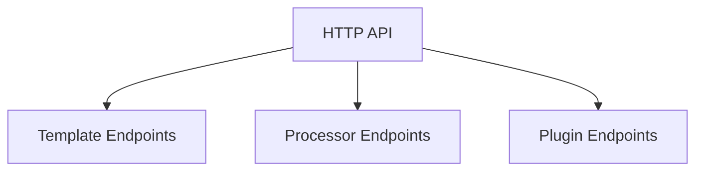

# Surfaces Overview

This section documents the HTTP API surfaces exposed by Helium SDKs for communication with the Boron coordinator, including Template, Processor, and Plugin endpoints.

## Map

How items in this section relate:

| Item                | Role                                           |
| ------------------- | ---------------------------------------------- |
| HTTP API            | External interfaces for Boron coordinator      |
| Template Endpoints  | `/api/template/init`, `/api/template/validate` |
| Processor Endpoints | `/api/process`                                 |
| Plugin Endpoints    | `/api/plug`                                    |

## All Surfaces

| Item                           | What                            | Why                                     | Key Files               |
| ------------------------------ | ------------------------------- | --------------------------------------- | ----------------------- |
| [HTTP API](./api/00-README.md) | REST endpoints for all services | Enables Boron coordinator communication | `sdks/node/src/main.ts` |

## Groups

### Group 1: HTTP Interfaces

- **[HTTP API](./api/00-README.md)** - REST endpoints documentation
