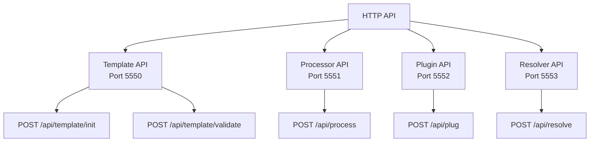

# HTTP API Overview

**Base Paths**:

- Template: `http://localhost:5550`
- Processor: `http://localhost:5551`
- Plugin: `http://localhost:5552`
- Resolver: `http://localhost:5553`

## Map

| API           | Port | Purpose                                   |
| ------------- | ---- | ----------------------------------------- |
| Template API  | 5550 | Interactive questioning for Cyan config   |
| Processor API | 5551 | File transformation                       |
| Plugin API    | 5552 | Post-processing hooks                     |
| Resolver API  | 5553 | Conflict resolution for multi-layer files |

## All Endpoints

| Endpoint                                                           | Method | Purpose                       | Key File                |
| ------------------------------------------------------------------ | ------ | ----------------------------- | ----------------------- |
| [Template Init](./01-template-api.md#post-apitemplateinit)         | POST   | Execute template with answers | `sdks/node/src/main.ts` |
| [Template Validate](./01-template-api.md#post-apitemplatevalidate) | POST   | Validate user input           | `sdks/node/src/main.ts` |
| [Process](./02-processor-api.md#post-apiprocess)                   | POST   | Process files                 | `sdks/node/src/main.ts` |
| [Plug](./03-plugin-api.md#post-apiplug)                            | POST   | Apply plugin                  | `sdks/node/src/main.ts` |
| [Resolve](./04-resolver-api.md#post-apiresolve)                    | POST   | Resolve file conflicts        | `sdks/node/src/main.ts` |

## Health Check

All services provide a health check endpoint:

| Endpoint | Method | Response                            |
| -------- | ------ | ----------------------------------- |
| `GET /`  | GET    | `{"Status": "OK", "Message": "OK"}` |

**Key File**: `sdks/node/src/main.ts` → `createApp()`

## Groups

### Group 1: Template Endpoints

- **[Template API](./01-template-api.md)** - `/api/template/init`, `/api/template/validate`

### Group 2: Processor Endpoint

- **[Processor API](./02-processor-api.md)** - `/api/process`

### Group 3: Plugin Endpoint

- **[Plugin API](./03-plugin-api.md)** - `/api/plug`

### Group 4: Resolver Endpoint

- **[Resolver API](./04-resolver-api.md)** - `/api/resolve`
